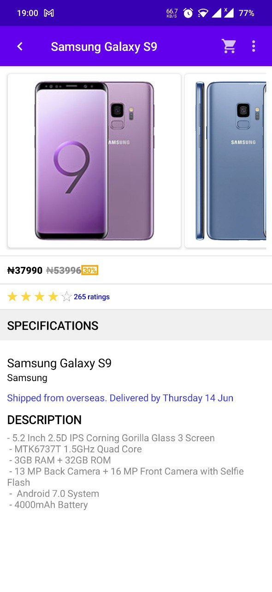

**Practicing modern Android tech-stacks and MVVM architecture** 

## Quick testing
- Parameters:
- *"phone"* - the query

## Tech stack & Open-source libraries
- Minimum SDK level 21
- 100% [Kotlin](https://kotlinlang.org/) based + [Coroutines](https://github.com/Kotlin/kotlinx.coroutines) + [Flow](https://kotlin.github.io/kotlinx.coroutines/kotlinx-coroutines-core/kotlinx.coroutines.flow/) for asynchronous.
- Hilt for dependency injection.
- JetPack
    - Compose - A modern toolkit for building native Android UI.
    - Lifecycle - dispose observing data when lifecycle state changes.
    - ViewModel - UI related data holder, lifecycle aware.
    - Room Persistence - construct database.
    - App Startup - Provides a straightforward, performant way to initialize components at application startup.
    - Paging - The Paging Library makes it easier for you to load data gradually and gracefully within your app's.

- Architecture
    - MVVM Architecture (Declarative View - ViewModel - Model)
    - Repository pattern
- Material Design & Animations
- [Accompanist](https://github.com/google/accompanist) - A collection of extension libraries for Jetpack Compose.
- [Coil](https://github.com/coil-kt/coil) - An image loading library for Android backed by Kotlin Coroutines.
- [Retrofit2 & OkHttp3](https://github.com/square/retrofit) - construct the REST APIs and paging network data.
- [Jetpack Compose RatingBar](https://github.com/a914-gowtham/compose-ratingbar) - A ratingbar for jetpack compose

**Testing** Instrumentation && JUnit tests

Few sample test using the following:

1.AndroidJUnitRunner
2.Mockk-mockito
3.Robolectric
4.kotlinx-coroutines-test

# Sample Screenshot

# ptc_android_test

Jumia Porto Tech Center (PTC) is an Agile IT development center, with around 200 IT-specialists,
where you will have the opportunity to participate in developing smart solutions for our group companies.
We do e-commerce shops, logistics, business intelligence and mobile applications involving a wide range of high-end technologies for tens of millions customers.

You can check our job opportunities at our site: https://group.jumia.com/careers.

We were founded in 2012 and today we are part of Jumia Group powered by Rocket Internet, Millicom, MTN, Axa Group,
Goldman Sachs, Orange and CDC.   Working at PTC means being in the first line of e-commerce development in emerging markets.

What you will find in PTC?

In PTC you will have an opportunity to develop and apply e-business software solutions for a wide range of business areas.

You will belong to the international team with the top experts who will inspire and support you in working on an international scale impacting millions of revenue (travelling, logistics, e-shops) and users.

We are humble and pragmatic.

We are passionate about what we do, and we have fun while doing it.

We move in a fast-pace and we are ready to challenge risks.

We value sharing knowledge and learning from each other. We are flexible and we believe that anything is possible.

We will offer you second home where you will find the opportunity for growth and career development.
You will have the opportunity to earn the bonus based on your excellent results.
The benefit list includes but is not limited to health insurance, parental bonus, snacks and fruits.

This repo represents the current admission test that is needed to apply for an Android Developer Position.

Android Challenge:
-

The idea is to create an app that is able to list products requested by a query.

The challenge Submission:
- Create a pull request using the base "development_mocklab"
- Title format "Challenge Admission Test - FIRST_NAME LAST_NAME"
- Write a description about your implementation

Description:
-

The application should be composed by:

    - Splash screen 
    - Search page 
    - Result list page 
    - Item detail page

The following requirements need to be met:

The search must be able to list items from a query.

1. The splash screen:
    - It's a loading page to request and save some configurations to be used.

2. The search page:
    - It's a page that allow the submission of a query to get a result, like Google Search.

3. The result list page:
    - It's a page that shows the query and respective result, like Google Search.
    - For each result item, the following should be displayed:
        - Image;
        - Name and brand;
        - Price, old price and discount;
        - Rating;

4. The item detail page:
    - It's a page that shows the information about the selected item
    - The following should be displayed:
        - Image or image gallery;
        - Name and brand;
        - Price, old price and discount;
        - Rating;
        - Description;

Mock API:
-

NOTE: The mocklab API is based in JSON mocks and only supports the following requests.

- Get configurations

  > http://nd7d1.mocklab.io/configurations/

  The currency should used to format the price and old price.

- Get list items with pagination

  > http://nd7d1.mocklab.io/search/phone/page/1/

  > http://nd7d1.mocklab.io/search/phone/page/2/

  Parameters:
    - *"phone"* - the query
    - *"1"* - the page number (pagination)

- Get detail item

  > http://nd7d1.mocklab.io/product/1/

  > http://nd7d1.mocklab.io/product/2/

  Parameters:
    - *"1"* - the product identifier "sku"

- Failure cases

  HTTP 200 - Success false:
  > http://nd7d1.mocklab.io/product/3/

  HTTP 404 - Not Found:
  > http://nd7d1.mocklab.io/search/phone/page/2/

  > http://nd7d1.mocklab.io/product/4/

Required tech implementations:
-
- Android Architecture Components;
- Material Design Components;
- Kotlin;
- Fragments;
- DataBinding;

We value the following implementations:
-
- Coroutines or RxAndroid;
- Unit tests;
- Animations;
- Image Loader (Volley/Picasso/Glide);
- Retrofit/OKHttp client for API communication;

Similar screens:
-

